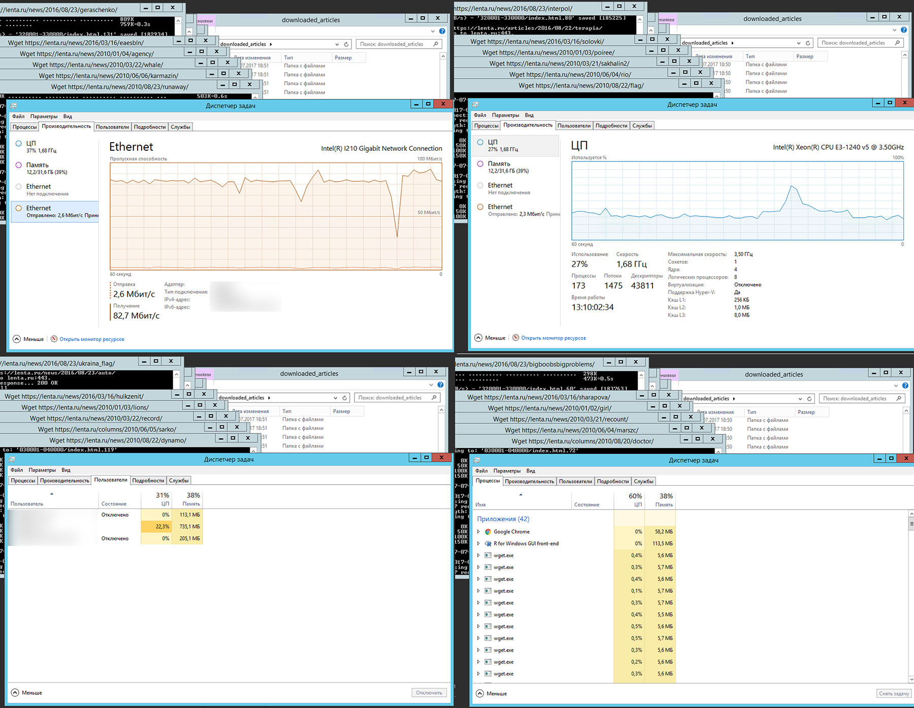
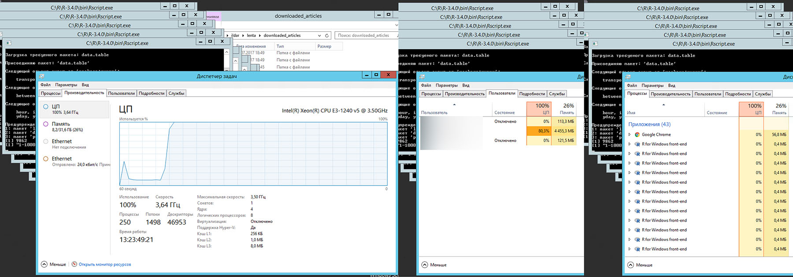

# Анализируй это. Lenta.ru (часть 1)
### What, How, Why

What - анализ статей новостного ресурса Lenta.ru за последние 18 лет (с 1 сентября 1999 года). How - весь процесс выполняется средствами языка R (с привлечением программы MySterm от Yandex на отдельном участке). Why... На мой взгляд, применяя вопросы "What, How and Why" в отношении какой-либо задачи, самое важное все-таки будет "Why". Именно ответ на этот вопрос определит, чего вы в итоге добьетесь и как вы это сделаете. В моем случае, коротким ответом на вопрос "почему" будет "получение опыта" в Big Data. Более развернутым же объяснением будет "выполнение какого-либо реального задания, в рамках которого я смогу применить навыки, полученные во время обучения, а так же получить результат, который я бы смог показывать в качестве подтверждения своих умений".  

> Мой бэкграунд - 15 лет в качестве программиста 1С и первые 5 курсов в специализации [Data Science](https://www.coursera.org/specializations/jhu-data-science) от Coursera.org, которые в основном давали базу и работу с R. Ну еще можно добавить опыт написания небольших процедур на Basic, Pascal и Java 17-18 лет назад. Несмотря на то, что в текущей профессии 80лвл почти достигнут, джоб-оффер из Гугла еще никто не прислал. Поэтому было принято решение повестить на мейстрим и пощупать бигдату, так как порог вхождения относительно ниже в сравнении той же Java. 

Конечно, определившись внутри себя, что мне нужны практика и портфолио, стоило бы схватить пару датасетов, коих сейчас море, и анализировать, анализировать, анализировать... Но прикинув в голове свои скилы по непосредственному анализу и вспомнив, что анализ это только 20-30% времени и остальное это поиск-сбор-очиска-подготовка данных, решил взяться за второе. Да и хотелось что-то особенное, возможно даже интересное, в отличии от анализа проданных в США авиабилетов за последние 30 лет или статистику арестов.

В качестве объекта исследования была выбрана [Lenta.ru](https://lenta.ru). От части, потому что я являюсь ее давним читателем, хоть и регулярно плююсь от того шлака, который проскакивает мимо редакторов (если таковые там вообще имеются). От части, потому что она показалась относительно легким для data mining. Однако если быть честным, то подходя к выбору объекта я практически не учитывал вопросы "а что я буду с этой датой делать" и "какие вопросы буду задавать". И связано это с тем, что на текущий момент я более-менее освоил только Getting and Cleaning Data и мои знания в части анализа очень скудны. Я конечно представлял себе, что как минимум могу ответить на вопрос "как изменилась среднедневное количество публикуемых новостей за последние 5-10 лет", но дальше этого я не задумывался.  

И так, эта статья будет посвящена добыванию и очистке данных, которые будут пригодны для анализа Lenta.ru. 

### Grabbing
Первым делом мне необходимо было определиться, как сграббить и распарсить содержимое страниц ресурса. Google подсказал, что оптимальным для этого будет использование пакета [rvest](https://cran.r-project.org/web/packages/rvest/rvest.pdf), который одновременно позволяет получить текст страницы по ее адресу и при помощи xPath выдернуть содержимое нужных мне полей. Конечно, продвинувшись дальше, мне пришлось разбить эту задачу на две - получение страниц и непосредственный парсинг, но это я понял позже, а пока первым шагом было получение списка ссылок на сами статьи.

После недолгого изучения, на сайте был обнаружен раздел "Архив", который при помощи простого скрипта переадресовывал меня на страницу, содержащую ссылки все новости за определенную дату и путь к этой странице выглядел как https://lenta.ru/2017/07/01/ или https://lenta.ru/2017/03/09/. Оставалось только пройтись по всем этим страницам и получить эти самые новостные ссылки. 
Для этих целей (граббинга и парсинга) так или иначе использовал следующие пакеты:
```R
require(lubridate)
require(rvest)
require(dplyr)
require(tidyr)
require(purrr)
require(XML)
require(data.table)
require(stringr)
require(jsonlite)
require(reshape2)
```

Не хитрый код, который позволил получить все ссылки на все статьи за последние 8 лет:
```R
articlesStartDate <- as.Date("2010-01-01")
articlesEndDate <- as.Date("2017-06-30")
## STEP 1. Prepare articles links list
# Dowload list of pages with archived articles. 
# Takes about 40 minutes
GetNewsListForPeriod <- function() {
  timestamp()
  # Prepare vector of links of archive pages in https://lenta.ru//yyyy/mm/dd/ format
  dayArray <- seq(as.Date(articlesStartDate), as.Date(articlesEndDate), 
                  by="days")
  archivePagesLinks <- paste0(baseURL, "/", year(dayArray), 
                              "/", formatC(month(dayArray), width = 2, format = "d", flag = "0"), 
                              "/", formatC(day(dayArray), width = 2, format = "d", flag = "0"), 
                              "/")
  # Go through all pages and extract all news links
  articlesLinks <- c()
  for (i in 1:length(archivePagesLinks)) {
    pg <- read_html(archivePagesLinks[i], encoding = "UTF-8")
    
    linksOnPage <- html_nodes(pg, 
                        xpath=".//section[@class='b-longgrid-column']//div[@class='titles']//a") %>% 
      html_attr("href")   
    articlesLinks <- c(articlesLinks, linksOnPage)
    saveRDS(articlesLinks, file.path(tempDataFolder, "tempArticlesLinks.rds"))
  }
  
  # Add root and write down all the news links
  articlesLinks <- paste0(baseURL, articlesLinks)
  writeLines(articlesLinks, file.path(tempDataFolder, "articles.urls"))
  timestamp()
}
```

Сгенерировав массив дат с `2010-01-01` по `2017-06-30` и преобразовав `archivePagesLinks`, я получил ссылки на все так называемые "архивные страницы":
```
> head(archivePagesLinks)
[1] "https://lenta.ru/2010/01/01/"
[2] "https://lenta.ru/2010/01/02/"
[3] "https://lenta.ru/2010/01/03/"
[4] "https://lenta.ru/2010/01/04/"
[5] "https://lenta.ru/2010/01/05/"
[6] "https://lenta.ru/2010/01/06/"
> length(archivePagesLinks)
[1] 2738
```

При помощи метода `read_html` я в цикле "скачал" содержимое страниц в буфер, а при помощи методов `html_nodes` и `html_attr` получил непосредственно ссылки на статьи, коих вышло почти `400К`:
```
> head(articlesLinks)
[1] "https://lenta.ru/news/2009/12/31/kids/"     
[2] "https://lenta.ru/news/2009/12/31/silvio/"   
[3] "https://lenta.ru/news/2009/12/31/postpone/" 
[4] "https://lenta.ru/photo/2009/12/31/meeting/" 
[5] "https://lenta.ru/news/2009/12/31/boeviks/"  
[6] "https://lenta.ru/news/2010/01/01/celebrate/"
> length(articlesLinks)
[1] 379862
```

После получения первых результатов я осознал проблему. Код, приведенный выше, выполнялся примерно `40 мин`. С учетом того, что за это время было обработано `2738` ссылок, можно посчитать, что для обработки `379862` ссылок уйдет `5550` минут или `92 с половиной часа`, что согласитесь, ни в какие ворота... Встроенные методы `readLines {base}` и `download.file {utils}`, которые позволяли просто получить текст, давали схожие результаты. Метод `htmlParse {XML}`, который позволял аналогично `read_html` скачать и продолжить парсинг содержимого, также ситуацию не улучшил. Тот же результат с использованием `getURL {RCurl}`. Тупик.


В поисках решения проблемы, я и гугл решили посмотреть в сторону "параллельного" исполнения моих запросов, так в момент работы кода ни сеть, ни память, ни процессор не были загружены. Гугл подсказал копнуть в сторону `parallel-package {parallel}`. Несколько часов изучения и тестов показали, что профита с запуском даже в двух "параллельных" потоках почему нет. Обрывочные сведения в гугле рассказали, что с помощью этого пакета можно распараллелить какие-нибудь вычисления или манипуляции с данными, но при работе с диском или внешним источником все запросы выполняются в рамках одного процесса и выстраиваются в очередь (могу ошибаться в понимании ситуации). Да и как понял, даже если бы тема и взлетела, ожидать увеличение производительности стоило только кратно имеющимся ядрам, т.е. даже при наличии 8 штук (которых у меня и не было) и реальной параллельности, курить мне предстояло примерно 690 минут. 

Следующей идеей было запустить параллельно несколько процессов R, в которых бы обрабатывалась своя часть большого списка ссылок. Однако гугл на вопрос "как из сессии R запустить несколько новых сессий R" ничего не сказал. Подумал еще над вариантом запуска R-скрипта через командную строку, но опыт работы с CMD были на уровне "набери dir и получишь список файлов в папке". Я снова оказался в тупике. 

Когда гугл перестал мне выдавать новые результаты, я с чистой совестью решил обратиться за помощью к залу. Так как гугл довольно часто выдавал [stackoverflow](https://stackoverflow.com), я решил попытать счастье именно там. Имея опыт общения на тематических форумах и зная реакцию на вопросы новичков, попытался максимально четко и ясно изложить [проблему](https://stackoverflow.com/questions/39180106/i-have-to-grab-plantext-from-over-290k-webpages-is-there-a-way-to-improve-the-s). И о чудо, спустя какие несколько часов я получил от [Bob Rudis](https://rud.is/) более чем развернутый ответ, который после подстановки в мой код, практически полностью решал мою задачу. Правда с оговоркой: я совершенно не понимал как он работает. Я первый раз слышал про `wget`, не понимал, что в коде делают с `WARC` и зачем в метод передают функцию (повторюсь, семинариев не кончал и в моем предыдущем языке таки финты не использовались). Однако если долго-долго смотреть на код, то просветление все таки приходит. А добавив попытки выполнять его по кускам, разбирая функцию за функцией, можно добиться определенных результатов. Ну а с `wget` мне помог справиться все тот же гугл. 

> Несмотря на то, что вся разработка велась в среде macOS, необходимость использования wget (а в дальнешйем и MyStem, которая заработала только по виндой), пришлось сузить среду исполнения до Windows. Я имею представление о том, что curl может делать что-то подобное, и возможно я таки выделю время и попробую реализовать с его помощью, но пока я решил не останавливаться на месте и идти дальше. 

В итоге суть решения свелась к следующему - предварительно подготовленный файл, содержащий ссылки на статьи, подсовывался команде `wget`:
```
  wget --warc-file=lenta -i lenta.urls
```

Непосредственно код выполнения выглядел так:
```R
  system("wget --warc-file=lenta -i lenta.urls", intern = FALSE)
```

После выполнения, я получал кучу файлов (по одному на каждую переданную ссылку) с html содержимым веб-страниц. Также в моем распоряжении был запакованный `WARC`, который содержал в себе лог общения с ресурсом, а так же то самое содержимое веб-страниц. Именно `WARC` и предлагал парсить [Bob Rudis](https://rud.is/). То что нужно. Причем у меня оставилсь копии прочитанных страниц, что делало возможно их повторное чтение.

Первые замеры производительности показали, что для закачки `2000` ссылок было потрачено `10 минут`, методом экстраполяции (давно хотел использовать это слово) получал `1890 минут` для всех статей - "олмост три таймс фастер бат нот энаф" - почти в три раза быстрее, но все равно недостаточно. Вернувшись на пару шагов назад и протестив новый механизм с учетом `parallel-package {parallel}`, понял, что и здесь профита не светит.

Оставался ход конем. Запуск нескольких по-настоящему параллельных процессов. С учетом того, что от "reproducible research" (принцип, о котором говорили на курсах) шаг в сторону я уже сделал (использовав внешнюю программу wget и фактически привязав выполнение к среде Windows), я решил сделать еще один шаг и снова вернуться к идее запуска параллельных процессов, однако уже вне R. Как заставить CMD файл выполнять несколько последовательных команд, не дожидаясь выполнения предыдущей (читай параллельно), рассказал все тот же [stackoverflow](https://stackoverflow.com). Оказалось, что замечательная команда `START` позволяет запустить команду на выполнение в отдельном окне. Вооружившись этим знанием, разродился следующим кодом:
```R
## STEP 2. Prepare wget CMD files for parallel downloading
# Create CMD file.
# Downloading process for 400K pages takes about 3 hours. Expect about 70GB 
# in html files and 12GB in compressed WARC files
CreateWgetCMDFiles <- function() {
  timestamp()
  articlesLinks <- readLines(file.path(tempDataFolder, "articles.urls"))
  dir.create(warcFolder, showWarnings = FALSE)
  
  # Split up articles links array by 10K links 
  numberOfLinks <- length(articlesLinks)
  digitNumber <- nchar(numberOfLinks)
  groupSize <- 10000
  filesGroup <- seq(from = 1, to = numberOfLinks, by = groupSize)
  cmdCodeAll <- c()
  
  for (i in 1:length(filesGroup)) {
    
    # Prepare folder name as 00001-10000, 10001-20000 etc
    firstFileInGroup <- filesGroup[i]
    lastFileInGroup <- min(firstFileInGroup + groupSize - 1, numberOfLinks)
    leftPartFolderName <- formatC(firstFileInGroup, width = digitNumber, 
                                  format = "d", flag = "0")
    rigthPartFolderName <- formatC(lastFileInGroup, width = digitNumber, 
                                   format = "d", flag = "0")
    subFolderName <- paste0(leftPartFolderName, "-", rigthPartFolderName)
    subFolderPath <- file.path(downloadedArticlesFolder, subFolderName)
    dir.create(subFolderPath)
    
    # Write articles.urls for each 10K folders that contains 10K articles urls
    writeLines(articlesLinks[firstFileInGroup:lastFileInGroup], 
               file.path(subFolderPath, "articles.urls"))
    
    # Add command line in CMD file that will looks like:
    # 'START wget --warc-file=warc\000001-010000 -i 000001-010000\list.urls -P 000001-010000'
    cmdCode <-paste0("START ..\\wget -i ", 
                     subFolderName, "\\", "articles.urls -P ", subFolderName)
    # Use commented code below for downloading with WARC files:
    #cmdCode <-paste0("START ..\\wget --warc-file=warc\\", subFolderName," -i ", 
    #                 subFolderName, "\\", "articles.urls -P ", subFolderName)
    
    cmdCodeAll <- c(cmdCodeAll, cmdCode)
  }
  
  # Write down command file
  cmdFile <- file.path(downloadedArticlesFolder, "start.cmd")
  writeLines(cmdCodeAll, cmdFile)
  print(paste0("Run ", cmdFile, " to start downloading."))
  print("wget.exe should be placed in working directory.")
  timestamp()
}
```

Этот код разбивает массив ссылок на блоки по 10000 штук (в моем случае получилось 38 блоков). Для каждого блока в цикле создается папка вида  `00001-10000`, `10001-20000` и т.д, в которую складывается свой собственный файл "articles.urls" (со своим 10-тысячным набором ссылок) и туда же попадут скачанные файлы. В этом же цикле собирается CMD файл, который должен одновременно запустить 38 окон:
```
START ..\wget --warc-file=warc\000001-010000 -i 000001-010000\articles.urls -P 000001-010000
START ..\wget --warc-file=warc\010001-020000 -i 010001-020000\articles.urls -P 010001-020000
START ..\wget --warc-file=warc\020001-030000 -i 020001-030000\articles.urls -P 020001-030000
...
START ..\wget --warc-file=warc\350001-360000 -i 350001-360000\articles.urls -P 350001-360000
START ..\wget --warc-file=warc\360001-370000 -i 360001-370000\articles.urls -P 360001-370000
START ..\wget --warc-file=warc\370001-379862 -i 370001-379862\articles.urls -P 370001-379862
```

Запуск запуск сформированного CMD файла запускает ожидаемые 38 окон с командой `wget` и дает следующую загрузку компьютера со следующими характеристиками `3.5GHz Xeon E-1240 v5, 32Gb, SSD, Windows Server 2012`



Итоговое время `180 минут` или `3 часа`. "Костыльный" параллелизм дал почти `10-кратный` выигрыш по сравнению с однопоточным выполнением `wget` и `30-кратный` выигрыш относительно изначального варианта использования `read_html {rvest}`. Это была первая маленькая победа и подобный "костыльный" подход мне пришлось применить потом еще несколько раз.

Результатом выполнения на жестком диске был представлен следующим:
```
> indexFiles <- list.files(downloadedArticlesFolder, full.names = TRUE, recursive = TRUE, pattern = "index")
> length(indexFiles)
[1] 379703
> sum(file.size(indexFiles))/1024/1024
[1] 66713.61
> warcFiles <- list.files(downloadedArticlesFolder, full.names = TRUE, recursive = TRUE, pattern = "warc")
> length(warcFiles)
[1] 38
> sum(file.size(warcFiles))/1024/1024
[1] 18770.4
```

Что означает `379703` скачанных веб-страниц общим размером `66713.61MB` и `38` сжатых `WARC`-файлы общим размером `18770.40MB`. Нехитрое вычисление показало, что я "потерял" `159` страниц. Возможно их судьбу можно узнать распарсив `WARC`-файлы по примеру от [Bob Rudis](https://rud.is/), но я решил списать их на погрешность и пойти своим путем, распарсивая непосредственно `379703` файлов.

### Parsing

Прежде чем что-то выдергивать со скачанной страницы, мне предстояло определить что именно выдергивать, какая именно информация мне может быть интересна. После долго изучения содержимого страниц, подготовил следующий код:
```R
# Parse srecific file
# Parse srecific file
ReadFile <- function(filename) {
  
  pg <- read_html(filename, encoding = "UTF-8")
  
  # Extract Title, Type, Description
  metaTitle <- html_nodes(pg, xpath=".//meta[@property='og:title']") %>%
    html_attr("content") %>% 
    SetNAIfZeroLength() 
  metaType <- html_nodes(pg, xpath=".//meta[@property='og:type']") %>% 
    html_attr("content") %>% 
    SetNAIfZeroLength()
  metaDescription <- html_nodes(pg, xpath=".//meta[@property='og:description']") %>% 
    html_attr("content") %>% 
    SetNAIfZeroLength()
  
  # Extract script contect that contains rubric and subrubric data
  scriptContent <- html_nodes(pg, xpath=".//script[contains(text(),'chapters: [')]") %>% 
    html_text() %>% 
    strsplit("\n") %>% 
    unlist()
  
  if (is.null(scriptContent[1])) {
    chapters <- NA
  } else if (is.na(scriptContent[1])) {
    chapters <- NA
  } else {
    chapters <- scriptContent[grep("chapters: ", scriptContent)] %>% unique()
  }
  
  articleBodyNode <- html_nodes(pg, xpath=".//div[@itemprop='articleBody']")
  
  # Extract articles body
  plaintext <- html_nodes(articleBodyNode, xpath=".//p") %>% 
    html_text() %>% 
    paste0(collapse="") 
  if (plaintext == "") {
    plaintext <- NA
  }
  
  # Extract links from articles body 
  plaintextLinks <- html_nodes(articleBodyNode, xpath=".//a") %>% 
    html_attr("href") %>% 
    unique() %>% 
    paste0(collapse=" ")
  if (plaintextLinks == "") {
    plaintextLinks <- NA
  }
  
  # Extract links related to articles
  additionalLinks <- html_nodes(pg, xpath=".//section/div[@class='item']/div/..//a") %>% 
    html_attr("href") %>% 
    unique() %>% 
    paste0(collapse=" ")
  if (additionalLinks == "") {
    additionalLinks <- NA
  }
  
  # Extract image Description and Credits
  imageNodes <- html_nodes(pg, xpath=".//div[@class='b-topic__title-image']")
  imageDescription <- html_nodes(imageNodes, xpath="div//div[@class='b-label__caption']") %>% 
    html_text() %>% 
    unique() %>% 
    SetNAIfZeroLength()
  imageCredits <- html_nodes(imageNodes, xpath="div//div[@class='b-label__credits']") %>% 
    html_text() %>% 
    unique() %>% 
    SetNAIfZeroLength() 
  
  # Extract video Description and Credits
  if (is.na(imageDescription)&is.na(imageCredits)) {
    videoNodes <- html_nodes(pg, xpath=".//div[@class='b-video-box__info']")
    videoDescription <- html_nodes(videoNodes, xpath="div[@class='b-video-box__caption']") %>% 
      html_text() %>% 
      unique() %>% 
      SetNAIfZeroLength()
    videoCredits <- html_nodes(videoNodes, xpath="div[@class='b-video-box__credits']") %>% 
      html_text() %>% 
      unique() %>% 
      SetNAIfZeroLength() 
  } else {
    videoDescription <- NA
    videoCredits <- NA
  }
  
  # Extract articles url
  url <- html_nodes(pg, xpath=".//head/link[@rel='canonical']") %>% 
    html_attr("href") %>% 
    SetNAIfZeroLength()
  
  # Extract authors
  authorSection <- html_nodes(pg, xpath=".//p[@class='b-topic__content__author']")
  authors <- html_nodes(authorSection, xpath="//span[@class='name']") %>% 
    html_text() %>% 
    SetNAIfZeroLength()
  if (length(authors) > 1) {
    authors <- paste0(authors, collapse = "|")
  }
  authorLinks <- html_nodes(authorSection, xpath="a") %>% html_attr("href") %>% SetNAIfZeroLength()
  if (length(authorLinks) > 1) {
    authorLinks <- paste0(authorLinks, collapse = "|")
  }
  
  # Extract publish date and time
  datetimeString <- html_nodes(pg, xpath=".//div[@class='b-topic__info']/time[@class='g-date']") %>% 
    html_text() %>% 
    unique() %>% 
    SetNAIfZeroLength()
  datetime <- html_nodes(pg, xpath=".//div[@class='b-topic__info']/time[@class='g-date']") %>% 
    html_attr("datetime") %>% unique() %>% SetNAIfZeroLength()
  if (is.na(datetimeString)) {
    datetimeString <- html_nodes(pg, xpath=".//div[@class='b-topic__date']") %>% 
      html_text() %>% 
      unique() %>% 
      SetNAIfZeroLength()
  }
  
  data.frame(url = url,
             filename = filename, 
             metaTitle= metaTitle,
             metaType= metaType,
             metaDescription= metaDescription,
             chapters = chapters,
             datetime = datetime,
             datetimeString = datetimeString,
             plaintext = plaintext, 
             authors = authors, 
             authorLinks = authorLinks,
             plaintextLinks = plaintextLinks,
             additionalLinks = additionalLinks, 
             imageDescription = imageDescription,
             imageCredits = imageCredits,
             videoDescription = videoDescription,
             videoCredits = videoCredits,
             stringsAsFactors=FALSE)
  
}
```

Для начала заголовок. Изначально я получал из `title` что-то вида `Швеция признана лучшей страной мира для иммигрантов: Общество: Мир: Lenta.ru`, в надежде разбить заголовок на непосредственный заголове и на рубрику с подрубрикой. Однако потом решил под подстраховки подтянуть заголовок в чистом виде из метаданных страницы.

Дату и время я получаю из `<time class="g-date" datetime="2017-07-10T12:35:00Z" itemprop="datePublished" pubdate=""> 15:35, 10 июля 2017</time>`, причем для подстраховки решил получить не только `2017-07-10T12:35:00Z`, но и текстовое представление `15:35, 10 июля 2017` и как оказалось не зря. Это текстовое представление позволило получать время статьи для случаев, когда `time[@class='g-date']` по какой-то причине на странице отсутствовал.

Авторство в статьях отмечается крайне редко, однако я все равно решил выдернуть эту информацию, на всякий случай. Также мне показалось интересным ссылки, которые появлялись в текстах самих статей и под ними в разделе "Ссылки по теме". На правильный парсинг информации о картинках и видео в начале статьи потратил чуть больше времени, чем хотелось бы, но тоже на всякий случай. 

Для получения рубрики и подрубрики (изначально хотел выдергивать из заголовка) я решил подстраховаться и сохранить строку `chapters: ["Мир","Общество","lenta.ru:_Мир:_Общество:_Швеция_признана_лучшей_страной_мира_для_иммигрантов"], // Chapters страницы`, показалось, что и нее выдернуть "Мир" и "Общество" будет чуть легче, чем из заголовка.

Особый интерес у меня вызвало количество расшариваний, количество комментариев к статье и конечно сами комментарии (словарное содержимое, временная активность), так как именно это было единственной информацией о том, как читатели реагировали на статью. Но именно самое интересное у меня и не получилось. Счетчики количества шар и камменнтов устанавливаются скриптом, который выполняетя после загрузки страницы. А весь мой суперхитрый код выкачивал страницу до этого момента, оставляя соответствующие поля пустыми. Комметарии также подгружаются скриптом, кроме того они отключаются для статей спустя какое-то время и получить их не представляется возможным. Но я еще работаю на этим вопросом, так как все-таки хочется увидеть зависимость наличия слов Украина/Путин/Кандолиза и количества срача в камментах.

> На самом деле, благодаря подсказке бывшего коллеги, у меня таки получилось добраться до этой инфы, но об этом будет ниже.

Вот в принципе и вся информация, которую я посчитал полезной.

Следущий код позволил мне запустить парсинг фалов, находящейся в первой папке (из 38):
```R
folderNumber <- 1
# Read and parse files in folder with provided number
ReadFilesInFolder <- function(folderNumber) {
  timestamp()
  # Get name of folder that have to be parsed
  folders <- list.files(downloadedArticlesFolder, full.names = FALSE, 
                        recursive = FALSE, pattern = "-")
  folderName <- folders[folderNumber]
  currentFolder <- file.path(downloadedArticlesFolder, folderName)
  files <- list.files(currentFolder, full.names = TRUE, 
                      recursive = FALSE, pattern = "index")
  
  # Split files in folder in 1000 chunks and parse them using ReadFile
  numberOfFiles <- length(files)
  print(numberOfFiles)
  groupSize <- 1000
  filesGroup <- seq(from = 1, to = numberOfFiles, by = groupSize)
  dfList <- list()
  for (i in 1:length(filesGroup)) {
    firstFileInGroup <- filesGroup[i]
    lastFileInGroup <- min(firstFileInGroup + groupSize - 1, numberOfFiles)
    print(paste0(firstFileInGroup, "-", lastFileInGroup))
    dfList[[i]] <- map_df(files[firstFileInGroup:lastFileInGroup], ReadFile)
  }
  
  # combine rows in data frame and write down
  df <- bind_rows(dfList)
  write.csv(df, file.path(parsedArticlesFolder, paste0(folderName, ".csv")), 
            fileEncoding = "UTF-8")
}
```

Получив адрес папки вида `00001-10000` и ее содержимое, я разбивал массив файлов на блоки по `1000` и в цикле при помощи `map_df` запускал свою функцию `ReadFile` для каждого такого блока.

Замеры показали, что для обработки `10000` статей, требуется примерно `8 минут` (причем `95%` времени занимал метод `read_html`). Все той же экстраполяцией получил `300 минут` или `5 часов`.

И вот обещанный второй ход конем. Запуск понастоящему параллельных сессий R (благо опыт общения с CMD уже имелся). Поэтому при помощи этого скрипта, я получил необходимый CMD файл:
```R
## STEP 3. Parse downloaded articles
# Create CMD file for parallel articles parsing.
# Parsing process takes about 1 hour. Expect about 1.7Gb in parsed files
CreateCMDForParsing <- function() {
  timestamp()
  # Get list of folders that contain downloaded articles
  folders <- list.files(downloadedArticlesFolder, full.names = FALSE, 
                        recursive = FALSE, pattern = "-")
  
  # Create CMD contains commands to run parse.R script with specified folder number
  nn <- 1:length(folders)
  cmdCodeAll <- paste0("start C:/R/R-3.4.0/bin/Rscript.exe ", 
                       file.path(getwd(), "parse.R "), nn)
  
  cmdFile <- file.path(downloadedArticlesFolder, "parsing.cmd")
  writeLines(cmdCodeAll, cmdFile)
  print(paste0("Run ", cmdFile, " to start parsing."))
  timestamp()
}
```

Вида:
```
start C:/R/R-3.4.0/bin/Rscript.exe C:/Users/ildar/lenta/parse.R 1
start C:/R/R-3.4.0/bin/Rscript.exe C:/Users/ildar/lenta/parse.R 2
start C:/R/R-3.4.0/bin/Rscript.exe C:/Users/ildar/lenta/parse.R 3
...
start C:/R/R-3.4.0/bin/Rscript.exe C:/Users/ildar/lenta/parse.R 36
start C:/R/R-3.4.0/bin/Rscript.exe C:/Users/ildar/lenta/parse.R 37
start C:/R/R-3.4.0/bin/Rscript.exe C:/Users/ildar/lenta/parse.R 38
```

Который в свою очередь запускал на выполнение 38 скриптов:
```R
args <- commandArgs(TRUE)
n <- as.integer(args[1])

# Set workling directory and locale for macOS and Windows
if (Sys.info()['sysname'] == "Windows") {
  workingDirectory <- paste0(Sys.getenv("HOMEPATH"), "\\lenta") 
  Sys.setlocale("LC_ALL", "Russian")
} else {
  workingDirectory <- ("~/lenta")
  Sys.setlocale("LC_ALL", "ru_RU.UTF-8")
}
setwd(workingDirectory)

source("get_lenta_articles_list.R")

ReadFilesInFolder(n)
```



Подобное распараллеливание, позволило `100%` загрузить сервер и выполнить поставленную задачу за `30 мин`. Очередной `10-кратный` выигрыш.

Остается только выполнить скрипт, который объединит 38 только что созданных файлов:
```R
## STEP 4. Prepare combined articles data
# Read all parsed csv and combine them in one.
# Expect about 1.7Gb in combined file
UnionData <- function() {
  timestamp()
  files <- list.files(parsedArticlesFolder, full.names = TRUE, recursive = FALSE)
  dfList <- c()
  for (i in 1:length(files)) {
    file <- files[i]
    print(file)
    dfList[[i]] <- read.csv(file, stringsAsFactors = FALSE, encoding = "UTF-8")
  }
  df <- bind_rows(dfList)
  write.csv(df, file.path(parsedArticlesFolder, "untidy_articles_data.csv"), 
            fileEncoding = "UTF-8")
  timestamp()
}
```

И в итоге у нас на диске `1.739MB` неочищеной и неприведенной даты:
```
> file.size(file.path(parsedArticlesFolder, "untidy_articles_data.csv"))/1024/1024
[1] 1739.047
```

Что же внутри?
```
> str(dfM, vec.len = 1)
'data.frame':   379746 obs. of  21 variables:
 $ X.1             : int  1 2 ...
 $ X               : int  1 2 ...
 $ url             : chr  "https://lenta.ru/news/2009/12/31/kids/" ...
 $ filename        : chr  "C:/Users/ildar/lenta/downloaded_articles/000001-010000/index.html" ...
 $ metaTitle       : chr  "Новым детским омбудсменом стал телеведущий Павел Астахов" ...
 $ metaType        : chr  "article" ...
 $ metaDescription : chr  "Президент РФ Дмитрий Медведев назначил нового уполномоченного по правам ребенка в России. Вместо Алексея Голова"| __truncated__ ...
 $ rubric          : logi  NA ...
 $ chapters        : chr  "          chapters: [\"Россия\",\"Страница_подраздела\",\"lenta.ru:_Россия:_Новым_детским_омбудсменом_стал_теле"| __truncated__ ...
 $ datetime        : chr  "2009-12-31T21:24:33Z" ...
 $ datetimeString  : chr  " 00:24,  1 января 2010" ...
 $ title           : chr  "Новым детским омбудсменом стал телеведущий Павел Астахов: Россия: Lenta.ru" ...
 $ plaintext       : chr  "Президент РФ Дмитрий Медведев назначил нового уполномоченного по правам ребенка в России. Вместо Алексея Голова"| __truncated__ ...
 $ authors         : chr  NA ...
 $ authorLinks     : chr  NA ...
 $ plaintextLinks  : chr  "http://www.interfax.ru/" ...
 $ additionalLinks : chr  "https://lenta.ru/news/2009/12/29/golovan/ https://lenta.ru/news/2009/09/01/children/" ...
 $ imageDescription: chr  NA ...
 $ imageCredits    : chr  NA ...
 $ videoDescription: chr  NA ...
 $ videoCredits    : chr  NA ...
```

Парсинг завершен. Осталось привести эту дату к состоянию, пригодному для анализа. Но перед этим добавим обещанный кусок про камменты и репосты.

### SOCIAL MEDIA

На самом деле, этот шаг был выполнен практически в конце первой части моего исследования (когда я почти получил пригодную для анализа дату). Если вы помните, веб-страница скачивалась без данных о комментариях и реакций соцсетей, так как эта информация заполнялась скриптами динамически. После подсказки, я решил проверить что показывает инспектор в Google Chrome в момент загрузки страницы и в разделе Network нашел следующее:
```
https://graph.facebook.com/?id=https%3A%2F%2Flenta.ru%2Fnews%2F2017%2F08%2F10%2Fudostov%2F
```

И в качестве ответа там было:
```
{
   "share": {
      "comment_count": 0,
      "share_count": 243
   },
   "og_object": {
      "id": "1959067174107041",
      "description": ...,
      "title": ...,
      "type": "article",
      "updated_time": "2017-08-10T09:21:29+0000"
   },
   "id": "https://lenta.ru/news/2017/08/10/udostov/"
}
```

Схожие запросы были обнаружены и для Вконтакта, Одноклассников и Рамблера, где хранились данные о количестве комментариев к каждой статье (сами комментарии мне получить так и не удалось). Как оказалось, достаточно было выполнить подобные запросы для каждой из статей. Так как количество запросов ожидалось `Количество статей Х 4`, то решил сразу воспользовать проверенным проверенным методом "параллелизации". 

Код, который подготавливает 4 CMD файла, которые которые запускают параллельное выполение запосов к социальным сетям:
```R
## STEP 5. Prepare wget CMD files for parallel downloading social
# Create CMD file.
CreateWgetCMDFilesForSocial <- function() {
  timestamp()
  articlesLinks <- readLines(file.path(tempDataFolder, "articles.urls"))
  dir.create(warcFolder, showWarnings = FALSE)
  dir.create(warcFolderForFB, showWarnings = FALSE)
  dir.create(warcFolderForVK, showWarnings = FALSE)
  dir.create(warcFolderForOK, showWarnings = FALSE)
  dir.create(warcFolderForCom, showWarnings = FALSE)
  
  # split up articles links array by 10K links 
  numberOfLinks <- length(articlesLinks)
  digitNumber <- nchar(numberOfLinks)
  groupSize <- 10000
  filesGroup <- seq(from = 1, to = numberOfLinks, by = groupSize)
  cmdCodeAll <- c()
  
  cmdCodeAllFB <- c()
  cmdCodeAllVK <- c()
  cmdCodeAllOK <- c()
  cmdCodeAllCom <- c() 
  
  for (i in 1:length(filesGroup)) {
    
    # Prepare folder name as 00001-10000, 10001-20000 etc
    firstFileInGroup <- filesGroup[i]
    lastFileInGroup <- min(firstFileInGroup + groupSize - 1, numberOfLinks)
    leftPartFolderName <- formatC(firstFileInGroup, width = digitNumber, 
                                  format = "d", flag = "0")
    rigthPartFolderName <- formatC(lastFileInGroup, width = digitNumber, 
                                   format = "d", flag = "0")
    subFolderName <- paste0(leftPartFolderName, "-", rigthPartFolderName)
    
    subFolderPathFB <- file.path(downloadedArticlesFolderForFB, subFolderName)
    dir.create(subFolderPathFB)
    subFolderPathVK <- file.path(downloadedArticlesFolderForVK, subFolderName)
    dir.create(subFolderPathVK)
    subFolderPathOK <- file.path(downloadedArticlesFolderForOK, subFolderName)
    dir.create(subFolderPathOK)
    subFolderPathCom <- file.path(downloadedArticlesFolderForCom, subFolderName)
    dir.create(subFolderPathCom)
    
    # Encode and write down articles.urls for each 10K folders that contains 
    # 10K articles urls.
    # For FB it has to be done in a bit different way because FB allows to pass 
    # up to 50 links as a request parameter.
    
    articlesLinksFB <- articlesLinks[firstFileInGroup:lastFileInGroup]
    numberOfLinksFB <- length(articlesLinksFB)
    digitNumberFB <- nchar(numberOfLinksFB)
    groupSizeFB <- 50
    filesGroupFB <- seq(from = 1, to = numberOfLinksFB, by = groupSizeFB)
    articlesLinksFBEncoded <- c()
    for (k in 1:length(filesGroupFB )) {
      firstFileInGroupFB <- filesGroupFB[k]
      lastFileInGroupFB <- min(firstFileInGroupFB + groupSizeFB - 1, numberOfLinksFB)	
      articlesLinksFBGroup <- paste0(articlesLinksFB[firstFileInGroupFB:lastFileInGroupFB], collapse = ",")
      articlesLinksFBGroup <- URLencode(articlesLinksFBGroup , reserved = TRUE)
      articlesLinksFBGroup <- paste0("https://graph.facebook.com/?fields=engagement&access_token=PlaceYourTokenHere&ids=", articlesLinksFBGroup)
      articlesLinksFBEncoded  <- c(articlesLinksFBEncoded, articlesLinksFBGroup)
    }
    
    articlesLinksVK <- paste0("https://vk.com/share.php?act=count&index=1&url=", 
                              sapply(articlesLinks[firstFileInGroup:lastFileInGroup], URLencode, reserved = TRUE), "&format=json")
    articlesLinksOK <- paste0("https://connect.ok.ru/dk?st.cmd=extLike&uid=okLenta&ref=", 
                              sapply(articlesLinks[firstFileInGroup:lastFileInGroup], URLencode, reserved = TRUE), "")
    articlesLinksCom <- paste0("https://c.rambler.ru/api/app/126/comments-count?xid=", 
                               sapply(articlesLinks[firstFileInGroup:lastFileInGroup], URLencode, reserved = TRUE), "")
    
    writeLines(articlesLinksFBEncoded, file.path(subFolderPathFB, "articles.urls"))
    writeLines(articlesLinksVK, file.path(subFolderPathVK, "articles.urls"))
    writeLines(articlesLinksOK, file.path(subFolderPathOK, "articles.urls"))
    writeLines(articlesLinksCom, file.path(subFolderPathCom, "articles.urls"))
    
    # Add command line in CMD file
    cmdCode <-paste0("START ..\\..\\wget --warc-file=warc\\", subFolderName," -i ", 
                     subFolderName, "\\", "articles.urls -P ", subFolderName, 
                     " --output-document=", subFolderName, "\\", "index")
    
    cmdCodeAll <- c(cmdCodeAll, cmdCode)
  }
  
  cmdFile <- file.path(downloadedArticlesFolderForFB, "start.cmd")
  print(paste0("Run ", cmdFile, " to start downloading."))
  writeLines(cmdCodeAll, cmdFile)
  cmdFile <- file.path(downloadedArticlesFolderForVK, "start.cmd")
  writeLines(cmdCodeAll, cmdFile)
  print(paste0("Run ", cmdFile, " to start downloading."))
  cmdFile <- file.path(downloadedArticlesFolderForOK, "start.cmd")
  writeLines(cmdCodeAll, cmdFile)
  print(paste0("Run ", cmdFile, " to start downloading."))
  cmdFile <- file.path(downloadedArticlesFolderForCom, "start.cmd")
  writeLines(cmdCodeAll, cmdFile)
  print(paste0("Run ", cmdFile, " to start downloading."))
  
  print("wget.exe should be placed in working directory.")
  timestamp()
}
```

Как и в предыдущих примерах, массив ссылок разбивается на куски по 10К, преобразуются в строку запроса (к каждой соцсети отдельно), складывается в соответствующие папки. После запуска командного файла и выполнения всех запросов, в соответствующих папках окажутся WARC файлы, содержащие ответы сервисов. Отдельно пришлось повозиться с фейсбуком, так как он не обрабатывал больше 100 запросов за раз. Чтобы увеличить лимит, пришлось зарегистрироваться как ФБ разработчик, зарегистрировать собственное приложение, получить токен и слать запросы уже с его указанием. А так как ФБ мог обрабатывать до 50 значений параметра в одном запросе, то строки запроса для него готовились чуть по другому.

Парсинг ответов был уже делом техники:
```R
## Parse downloaded articles social
ReadSocial <- function() {
  timestamp()
  # Read and parse all warc files in FB folder
  dfList <- list()
  dfN <- 0  
  warcs <- list.files(file.path(downloadedArticlesFolderForFB, "warc"), full.names = TRUE, 
                      recursive = FALSE) 
  for (i in 1:length(warcs)) {
    
    filename <- warcs[i]
    print(filename)
    res <- readLines(filename, warn = FALSE, encoding = "UTF-8")
    anchorPositions <- which(res == "WARC-Type: response")
    responsesJSON <- res[anchorPositions + 28]
    
    getID <- function(responses) { 
      links <- sapply(responses, function(x){x$id}, USE.NAMES = FALSE) %>% unname() 
      links}
    getQuantity <- function(responses) { 
      links <- sapply(responses, function(x){x$engagement$share_count}, USE.NAMES = FALSE) %>% unname() 
      links}    
    for(k in 1:length(responsesJSON)) {
      if(responsesJSON[k]==""){ next }
      responses <- fromJSON(responsesJSON[k])
      if(!is.null(responses$error)) { next }
      links <- sapply(responses, function(x){x$id}, USE.NAMES = FALSE) %>% unname() %>% unlist()
      quantities <- sapply(responses, function(x){x$engagement$share_count}, USE.NAMES = FALSE) %>% unname() %>% unlist() 
      df <- data.frame(link = links, quantity = quantities, social = "FB", stringsAsFactors = FALSE)  
      dfN <- dfN + 1
      dfList[[dfN]] <- df
    }
  }
  dfFB <- bind_rows(dfList)
  
  # Read and parse all warc files in VK folder
  dfList <- list()
  dfN <- 0  
  warcs <- list.files(file.path(downloadedArticlesFolderForVK, "warc"), full.names = TRUE, 
                      recursive = FALSE) 
  for (i in 1:length(warcs)) {
    
    filename <- warcs[i]
    print(filename)
    res <- readLines(filename, warn = FALSE, encoding = "UTF-8")
    anchorPositions <- which(res == "WARC-Type: response")
    links <- res[anchorPositions + 4] %>% 
      str_replace_all("WARC-Target-URI: https://vk.com/share.php\\?act=count&index=1&url=|&format=json", "") %>%
      sapply(URLdecode) %>% unname()
    quantities <- res[anchorPositions + 24] %>% 
      str_replace_all(" |.*\\,|\\);", "") %>%
      as.integer()
    df <- data.frame(link = links, quantity = quantities, social = "VK", stringsAsFactors = FALSE)  
    dfN <- dfN + 1
    dfList[[dfN]] <- df
  }
  dfVK <- bind_rows(dfList)
  
  # Read and parse all warc files in OK folder
  dfList <- list()
  dfN <- 0 
  warcs <- list.files(file.path(downloadedArticlesFolderForOK, "warc"), full.names = TRUE, 
                      recursive = FALSE) 
  for (i in 1:length(warcs)) {
    
    filename <- warcs[i]
    print(filename)
    res <- readLines(filename, warn = FALSE, encoding = "UTF-8")
    anchorPositions <- which(res == "WARC-Type: response")
    links <- res[anchorPositions + 4] %>% 
      str_replace_all("WARC-Target-URI: https://connect.ok.ru/dk\\?st.cmd=extLike&uid=okLenta&ref=", "") %>%
      sapply(URLdecode) %>% unname()
    quantities <- res[anchorPositions + 22] %>% 
      str_replace_all(" |.*\\,|\\);|'", "") %>%
      as.integer()
    df <- data.frame(link = links, quantity = quantities, social = "OK", stringsAsFactors = FALSE)  
    dfN <- dfN + 1
    dfList[[dfN]] <- df
  }
  dfOK <- bind_rows(dfList)
  
  # Read and parse all warc files in Com folder
  dfList <- list()
  dfN <- 0  
  warcs <- list.files(file.path(downloadedArticlesFolderForCom, "warc"), full.names = TRUE, 
                      recursive = FALSE) 
  x <- c()
  for (i in 1:length(warcs)) {
    
    filename <- warcs[i]
    print(filename)
    res <- readLines(filename, warn = FALSE, encoding = "UTF-8")
    anchorPositions <- which(str_sub(res, start = 1, end = 9) == '{"xids":{')
    x <- c(x, res[anchorPositions])
  }  
  for (i in 1:length(warcs)) {
    
    filename <- warcs[i]
    print(filename)
    res <- readLines(filename, warn = FALSE, encoding = "UTF-8")
    anchorPositions <- which(str_sub(res, start = 1, end = 9) == '{"xids":{')
    x <- c(x, res[anchorPositions])
    responses <- res[anchorPositions] %>% 
      str_replace_all('\\{\\"xids\\":\\{|\\}', "")
    if(responses==""){ next }
    links <- str_replace_all(responses, "(\":[^ ]+)|\"", "")
    quantities <- str_replace_all(responses, ".*:", "") %>%
      as.integer()
    df <- data.frame(link = links, quantity = quantities, social = "Com", stringsAsFactors = FALSE)  
    dfN <- dfN + 1
    dfList[[dfN]] <- df
  }
  dfCom <- bind_rows(dfList)
  dfCom <- dfCom[dfCom$link!="",]
  
  # Combine dfs and reshape them into "link", "FB", "VK", "OK", "Com"
  dfList <- list()
  dfList[[1]] <- dfFB
  dfList[[2]] <- dfVK
  dfList[[3]] <- dfOK
  dfList[[4]] <- dfCom
  df <- bind_rows(dfList) 
  dfCasted <- dcast(df, link ~ social, value.var = "quantity")
  dfCasted <- dfCasted[order(dfCasted$link),]
  
  write.csv(dfCasted, file.path(parsedArticlesFolder, "social_articles.csv"), 
            fileEncoding = "UTF-8")
  timestamp()
}
```

На этом сбор данных окончен. Приступаем к обработке.


### Cleaning

Как видно из предыдущего текста, работать пришлось с датой `379746 obs. of  21 variables and size of 1.739MB`, чтение которой было делом не быстрым. Однако гугл и стаковерфлоу довольно быстро подсказали выход в качестве `fread {data.table}`. Разница:
```
> system.time(dfM <- read.csv(untidyDataFile, stringsAsFactors = FALSE, encoding = "UTF-8"))
пользователь      система       прошло 
      133.17         1.50       134.67 
> system.time(dfM <- fread(untidyDataFile, stringsAsFactors = FALSE, encoding = "UTF-8"))
Read 379746 rows and 21 (of 21) columns from 1.698 GB file in 00:00:18
пользователь      система       прошло 
       17.67         0.54        18.22 
```

Ну а дальше предстояло проверить каждую колонку таблицы, есть ли в ней что-нибудь вменяемое или там только `NA`. И если что-то есть - привести это что-то к читаемому виду (на этом этапе мне пришлось несколько раз подпиливать Parsing). В итоге код, который приводил дату в вид, готовый для анализа стал таким:
```R
# Load required packages
require(lubridate)
require(dplyr)
require(tidyr)
require(data.table)
require(tldextract)
require(XML)
require(stringr)
require(tm)

# Set workling directory and locale for macOS and Windows
if (Sys.info()['sysname'] == "Windows") {
  workingDirectory <- paste0(Sys.getenv("HOMEPATH"), "\\lenta") 
  Sys.setlocale("LC_ALL", "Russian")
} else {
  workingDirectory <- ("~/lenta")
  Sys.setlocale("LC_ALL", "ru_RU.UTF-8")
}
setwd(workingDirectory)

# Set common variables
parsedArticlesFolder <- file.path(getwd(), "parsed_articles")
tidyArticlesFolder <- file.path(getwd(), "tidy_articles")

# Creare required folders if not exist 
dir.create(tidyArticlesFolder, showWarnings = FALSE)

## STEP 5. Clear and tidy data
# Section 7 takes about 2-4 hours
TityData <- function() {
  
  dfM <- fread(file.path(parsedArticlesFolder, "untidy_articles_data.csv"), 
               stringsAsFactors = FALSE, encoding = "UTF-8")
  # SECTION 1
  print(paste0("1 ",Sys.time()))
  # Remove duplicate rows, remove rows with url = NA, create urlKey column as a key
  dtD <- dfM %>% 
    select(-V1,-X)  %>% 
    distinct(url, .keep_all = TRUE) %>% 
    na.omit(cols="url") %>%
    mutate(urlKey = gsub(":|\\.|/", "", url))
  
  # Function SplitChapters is used to process formatted chapter column and retrive rubric 
  # and subrubric  
  SplitChapters <- function(x) {
    splitOne <- strsplit(x, "lenta.ru:_")[[1]]
    splitLeft <- strsplit(splitOne[1], ",")[[1]]
    splitLeft <- unlist(strsplit(splitLeft, ":_"))
    splitRight <- strsplit(splitOne[2], ":_")[[1]]
    splitRight <- splitRight[splitRight %in% splitLeft]
    splitRight <- gsub("_", " ", splitRight)
    paste0(splitRight, collapse = "|")
  }
  
  # SECTION 2
  print(paste0("2 ",Sys.time()))  
  # Process chapter column to retrive rubric and subrubric
  # Column value such as:
  # chapters: ["Бывший_СССР","Украина","lenta.ru:_Бывший_СССР:_Украина:_Правительство_ФРГ_сочло_неприемлемым_создание_Малороссии"], // Chapters страницы
  # should be represented as rubric value "Бывший СССР" 
  # and subrubric value "Украина"
  dtD <- dtD %>% 
    mutate(chapters = gsub('\"|\\[|\\]| |chapters:', "", chapters)) %>%
    mutate(chaptersFormatted = as.character(sapply(chapters, SplitChapters))) %>%
    separate(col = "chaptersFormatted", into = c("rubric", "subrubric")
             , sep = "\\|", extra = "drop", fill = "right", remove = FALSE) %>%
    filter(!rubric == "NA") %>%
    select(-chapters, -chaptersFormatted) 
  
  # SECTION 3
  print(paste0("3 ",Sys.time()))
  # Process imageCredits column and split into imageCreditsPerson 
  # and imageCreditsCompany
  # Column value such as: "Фото: Игорь Маслов / РИА Новости" should be represented
  # as imageCreditsPerson value "Игорь Маслов" and 
  # imageCreditsCompany value "РИА Новости"
  pattern <- 'Фото: |Фото |Кадр: |Изображение: |, архив|(архив)|©|«|»|\\(|)|\"'
  dtD <- dtD %>% 
    mutate(imageCredits = gsub(pattern, "", imageCredits)) %>%
    separate(col = "imageCredits", into = c("imageCreditsPerson", "imageCreditsCompany")
             , sep = "/", extra = "drop", fill = "left", remove = FALSE) %>%
    mutate(imageCreditsPerson = as.character(sapply(imageCreditsPerson, trimws))) %>%
    mutate(imageCreditsCompany = as.character(sapply(imageCreditsCompany, trimws))) %>%
    select(-imageCredits)
  
  # SECTION 4
  print(paste0("4 ",Sys.time()))
  # Function UpdateDatetime is used to process missed values in datetime column
  # and fill them up with date and time retrived from string presentation 
  # such as "13:47, 18 июля 2017" or from url such 
  # as https://lenta.ru/news/2017/07/18/frg/. Hours and Minutes set randomly
  # from 8 to 21 in last case
  months <- c("января", "февраля", "марта", "апреля", "мая", "июня", "июля", 
              "августа", "сентября", "октября", "ноября", "декабря")
  UpdateDatetime <- function (datetime, datetimeString, url) {
    datetimeNew <- datetime
    if (is.na(datetime)) { 
      if (is.na(datetimeString)) {
        parsedURL <- strsplit(url, "/")[[1]]
        parsedURLLength <- length(parsedURL)
        d <- parsedURL[parsedURLLength-1]
        m <- parsedURL[parsedURLLength-2]
        y <- parsedURL[parsedURLLength-3] 
        H <- round(runif(1, 8, 21))
        M <- round(runif(1, 1, 59))
        S <- 0
        datetimeString <- paste0(paste0(c(y, m, d), collapse = "-"), " ", 
                                 paste0(c(H, M, S), collapse = ":"))
        datetimeNew <- ymd_hms(datetimeString, tz = "Europe/Moscow", quiet = TRUE)
      } else {
        parsedDatetimeString <- unlist(strsplit(datetimeString, ",")) %>% 
          trimws %>% 
          strsplit(" ") %>% 
          unlist()
        monthNumber <- which(grepl(parsedDatetimeString[3], months))
        dateString <- paste0(c(parsedDatetimeString[4], monthNumber, 
                               parsedDatetimeString[2]), collapse = "-")
        datetimeString <- paste0(dateString, " ", parsedDatetimeString[1], ":00")
        datetimeNew <- ymd_hms(datetimeString, tz = "Europe/Moscow", quiet = TRUE)
      }
    }  
    datetimeNew
  }
  
  # Process datetime and fill up missed values
  dtD <- dtD %>% 
    mutate(datetime = ymd_hms(datetime, tz = "Europe/Moscow", quiet = TRUE)) %>% 
    mutate(datetimeNew = mapply(UpdateDatetime, datetime, datetimeString, url)) %>%
    mutate(datetime = as.POSIXct(datetimeNew, tz = "Europe/Moscow",origin = "1970-01-01"))
  
  # SECTION 5
  print(paste0("5 ",Sys.time()))  
  # Remove rows with missed datetime values, rename metaTitle to title,
  # remove columns that we do not need anymore  
  dtD <- dtD %>%
    as.data.table() %>%
    na.omit(cols="datetime") %>%
    select(-filename, -metaType, -datetimeString, -datetimeNew) %>%
    rename(title = metaTitle) %>%
    select(url, urlKey, datetime, rubric, subrubric, title, metaDescription, plaintext, 
           authorLinks, additionalLinks, plaintextLinks, imageDescription, imageCreditsPerson,
           imageCreditsCompany, videoDescription, videoCredits)
  
  # SECTION 6
  print(paste0("6 ",Sys.time()))
  # Clean additionalLinks and plaintextLinks
  symbolsToRemove <- "href=|-–-|«|»|…|,|•|“|”|\n|\"|,|[|]|<a|<br" 
  symbolsHttp <- "http:\\\\\\\\|:http://|-http://|.http://"
  symbolsHttp2 <- "http://http://|https://https://"
  symbolsReplace <- "[а-я|А-Я|#!]"
  
  dtD <- dtD %>% 
    mutate(plaintextLinks = gsub(symbolsToRemove,"", plaintextLinks)) %>%
    mutate(plaintextLinks = gsub(symbolsHttp, "http://", plaintextLinks)) %>%
    mutate(plaintextLinks = gsub(symbolsReplace, "e", plaintextLinks)) %>%
    mutate(plaintextLinks = gsub(symbolsHttp2, "http://", plaintextLinks)) %>%
    mutate(additionalLinks = gsub(symbolsToRemove,"", additionalLinks)) %>%
    mutate(additionalLinks = gsub(symbolsHttp, "http://", additionalLinks)) %>%
    mutate(additionalLinks = gsub(symbolsReplace, "e", additionalLinks)) %>%
    mutate(additionalLinks = gsub(symbolsHttp2, "http://", additionalLinks))
  
  # SECTION 7
  print(paste0("7 ",Sys.time()))
  # Clean additionalLinks and plaintextLinks using UpdateAdditionalLinks 
  # function. Links such as:
  # "http://www.dw.com/ru/../B2 https://www.welt.de/politik/.../de/"
  # should be represented as "dw.com welt.de"
  
  # Function UpdateAdditionalLinks is used to process and clean additionalLinks 
  # and plaintextLinks
  UpdateAdditionalLinks <- function(additionalLinks, url) {
    if (is.na(additionalLinks)) {
      return(NA)
    }
    
    additionalLinksSplitted <- gsub("http://|https://|http:///|https:///"," ", additionalLinks)
    additionalLinksSplitted <- gsub("http:/|https:/|htt://","", additionalLinksSplitted)
    additionalLinksSplitted <- trimws(additionalLinksSplitted)
    additionalLinksSplitted <- unlist(strsplit(additionalLinksSplitted, " "))
    additionalLinksSplitted <- additionalLinksSplitted[!additionalLinksSplitted==""]
    additionalLinksSplitted <- additionalLinksSplitted[!grepl("lenta.", additionalLinksSplitted)]
    additionalLinksSplitted <- unlist(strsplit(additionalLinksSplitted, "/[^/]*$"))
    additionalLinksSplitted <- paste0("http://", additionalLinksSplitted)
    
    if (!length(additionalLinksSplitted) == 0) {
      URLSplitted <- c()
      for(i in 1:length(additionalLinksSplitted)) {
        parsed <- tryCatch(parseURI(additionalLinksSplitted[i]), error = function(x) {return(NA)}) 
        parsedURL <- parsed["server"]
        if (!is.na(parsedURL)) {
          URLSplitted <- c(URLSplitted, parsedURL) 
        }
      }
      if (length(URLSplitted)==0){
        NA
      } else {
        URLSplitted <- URLSplitted[!is.na(URLSplitted)]
        paste0(URLSplitted, collapse = " ")
      }
    } else {
      NA
    }
  }
  
  # Function UpdateAdditionalLinksDomain is used to process additionalLinks 
  # and plaintextLinks and retrive source domain name
  UpdateAdditionalLinksDomain <- function(additionalLinks, url) {
    if (is.na(additionalLinks)|(additionalLinks=="NA")) {
      return(NA)
    }
    additionalLinksSplitted <- unlist(strsplit(additionalLinks, " "))
    if (!length(additionalLinksSplitted) == 0) {
      parsedDomain <- tryCatch(tldextract(additionalLinksSplitted), error = function(x) {data_frame(domain = NA, tld = NA)}) 
      parsedDomain <- parsedDomain[!is.na(parsedDomain$domain), ]
      if (nrow(parsedDomain)==0) {
        #print("--------")
        #print(additionalLinks)
        return(NA)
      }
      domain <- paste0(parsedDomain$domain, ".", parsedDomain$tld)
      domain <- unique(domain)
      domain <- paste0(domain, collapse = " ")
      return(domain)
    } else {
      return(NA)
    }
  }
  
  dtD <- dtD %>% 
    mutate(plaintextLinks = mapply(UpdateAdditionalLinks, plaintextLinks, url)) %>%
    mutate(additionalLinks = mapply(UpdateAdditionalLinks, additionalLinks, url))
  
  # Retrive domain from external links using updateAdditionalLinksDomain 
  # function. Links such as:
  # "http://www.dw.com/ru/../B2 https://www.welt.de/politik/.../de/"
  # should be represented as "dw.com welt.de"  
  numberOfLinks <- nrow(dtD)
  groupSize <- 10000
  groupsN <- seq(from = 1, to = numberOfLinks, by = groupSize)
  
  for (i in 1:length(groupsN)) {
    n1 <- groupsN[i]
    n2 <- min(n1 + groupSize - 1, numberOfLinks) 
    dtD$additionalLinks[n1:n2] <- mapply(UpdateAdditionalLinksDomain, dtD$additionalLinks[n1:n2], dtD$url[n1:n2])
    dtD$plaintextLinks[n1:n2] <- mapply(UpdateAdditionalLinksDomain, dtD$plaintextLinks[n1:n2], dtD$url[n1:n2])
  }
  
  # SECTION 8
  print(paste0("8 ",Sys.time()))
  # Clean title, descriprion and plain text. Remove puntuation and stop words.
  # Prepare for the stem step
  stopWords <- readLines("stop_words.txt", warn = FALSE, encoding = "UTF-8")
  
  dtD <- dtD %>% as.tbl() %>% mutate(stemTitle = tolower(title), 
                                                 stemMetaDescription = tolower(metaDescription), 
                                                 stemPlaintext = tolower(plaintext))
  dtD <- dtD %>% as.tbl() %>% mutate(stemTitle = enc2utf8(stemTitle), 
                                                 stemMetaDescription = enc2utf8(stemMetaDescription), 
                                                 stemPlaintext = enc2utf8(stemPlaintext))
  dtD <- dtD %>% as.tbl() %>% mutate(stemTitle = removeWords(stemTitle, stopWords), 
                                                 stemMetaDescription = removeWords(stemMetaDescription, stopWords), 
                                                 stemPlaintext = removeWords(stemPlaintext, stopWords))
  dtD <- dtD %>% as.tbl() %>% mutate(stemTitle = removePunctuation(stemTitle), 
                                                 stemMetaDescription = removePunctuation(stemMetaDescription), 
                                                 stemPlaintext = removePunctuation(stemPlaintext))   
  dtD <- dtD %>% as.tbl() %>% mutate(stemTitle = str_replace_all(stemTitle, "\\s+", " "), 
                                                 stemMetaDescription = str_replace_all(stemMetaDescription, "\\s+", " "), 
                                                 stemPlaintext = str_replace_all(stemPlaintext, "\\s+", " "))    
  dtD <- dtD %>% as.tbl() %>% mutate(stemTitle = str_trim(stemTitle, side = "both"), 
                                                 stemMetaDescription = str_trim(stemMetaDescription, side = "both"), 
                                                 stemPlaintext = str_trim(stemPlaintext, side = "both"))
  # SECTION 9
  print(paste0("9 ",Sys.time()))
  write.csv(dtD, file.path(tidyArticlesFolder, "tidy_articles_data.csv"), fileEncoding = "UTF-8")
  
  # SECTION 10 Finish
  print(paste0("10 ",Sys.time()))
  
  # SECTION 11 Adding social
  dfM <- read.csv(file.path(tidyArticlesFolder, "tidy_articles_data.csv"), stringsAsFactors = FALSE, encoding = "UTF-8")
  dfS <- read.csv(file.path(parsedArticlesFolder, "social_articles.csv"), stringsAsFactors = FALSE, encoding = "UTF-8")
  dt <- as.tbl(dfM)
  dtS <- as.tbl(dfS) %>% rename(url = link) %>% select(url, FB, VK, OK, Com)
  dtG <- left_join(dt, dtS, by = "url")
  write.csv(dtG, file.path(tidyArticlesFolder, "tidy_articles_data.csv"), fileEncoding = "UTF-8")
}
```

Так как внезапно столкнулся с длительным исполнением кода, добавил секции и `time stamp` в виде `print(paste0("1 ",Sys.time()))`. Результаты на собственном макбуке `2.7GHz i5, 16Gb Ram, SSD, macOS 10.12, R version 3.4.0`:
```
[1] "1 2017-07-21 16:36:59"
[1] "2 2017-07-21 16:37:13"
[1] "3 2017-07-21 16:38:15"
[1] "4 2017-07-21 16:39:11"
[1] "5 2017-07-21 16:42:58"
[1] "6 2017-07-21 16:42:58"
[1] "7 2017-07-21 16:43:35"
[1] "8 2017-07-21 18:41:25"
[1] "9 2017-07-21 19:00:32"
[1] "10 2017-07-21 19:01:04"
```

Результаты на сервере `3.5GHz Xeon E-1240 v5, 32Gb, SSD, Windows Server 2012`:
```
[1] "1 2017-07-21 14:36:44"
[1] "2 2017-07-21 14:37:08"
[1] "3 2017-07-21 14:38:23"
[1] "4 2017-07-21 14:41:24"
[1] "5 2017-07-21 14:46:02"
[1] "6 2017-07-21 14:46:02"
[1] "7 2017-07-21 14:46:57"
[1] "8 2017-07-21 18:58:04"
[1] "9 2017-07-21 19:30:27"
[1] "10 2017-07-21 19:35:18"
```

Внезапно (а может и ожидаемо), выполнение функции `UpdateAdditionalLinksDomain` (которая выдергивает домен и доменную зону для формирования ключа источника) стало самым времязатратным местом. Причем все упиралось в метод `tldextract {tldextract}`. На самом деле уделять время на дополнительную оптимизацию я не стал и если кто-нибудь сходу тыкнет пальцем куда копнуть - обязательно выделю время и попробую оптимизировать.

> Вопрос залу - почему казалось бы заведомо более мощный сервер выполняет одинаковый код в 2 раза медленее? Секция 7 выполняется 4 часа против 2 часов на макбуке.

В целом по камментам думаю понятно, какие преобразования происходят над данными. Результат:
```
> str(dfM, vec.len = 1)
'data.frame':   379746 obs. of  21 variables:
 $ X.1             : int  1 2 ...
 $ X               : int  1 2 ...
 $ url             : chr  "https://lenta.ru/news/2009/12/31/kids/" ...
 $ filename        : chr  "C:/Users/ildar/lenta/downloaded_articles/000001-010000/index.html" ...
> str(dfM, vec.len = 1)
Classes ‘data.table’ and 'data.frame':  376913 obs. of  19 variables:
 $ url                : chr  "https://lenta.ru/news/2009/12/31/kids/" ...
 $ urlKey             : chr  "httpslentarunews20091231kids" ...
 $ datetime           : chr  "2010-01-01 00:24:33" ...
 $ rubric             : chr  "Россия" ...
 $ subrubric          : chr  NA ...
 $ title              : chr  "Новым детским омбудсменом стал телеведущий Павел Астахов" ...
 $ metaDescription    : chr  "Президент РФ Дмитрий Медведев назначил нового уполномоченного по правам ребенка в России. Вместо Алексея Голова"| __truncated__ ...
 $ plaintext          : chr  "Президент РФ Дмитрий Медведев назначил нового уполномоченного по правам ребенка в России. Вместо Алексея Голова"| __truncated__ ...
 $ authorLinks        : chr  NA ...
 $ additionalLinks    : chr  NA ...
 $ plaintextLinks     : chr  "interfax.ru" ...
 $ imageDescription   : chr  NA ...
 $ imageCreditsPerson : chr  NA ...
 $ imageCreditsCompany: chr  NA ...
 $ videoDescription   : chr  NA ...
 $ videoCredits       : chr  NA ...
 $ stemTitle          : chr  "новым детским омбудсменом стал телеведущий павел астахов" ...
 $ stemMetaDescription: chr  "президент рф дмитрий медведев назначил нового уполномоченного правам ребенка россии вместо алексея голованя про"| __truncated__ ...
 $ stemPlaintext      : chr  "президент рф дмитрий медведев назначил нового уполномоченного правам ребенка россии вместо алексея голованя про"| __truncated__ ...
```
Все готово для финального шага.
И да, файл потолстел до:
```
> file.size(file.path(tidyArticlesFolder, "tidy_articles_data.csv"))/1024/1024
[1] 2741.01
```

### REPRODUCIBLE RESEARCH
Однако финальный шаг (а именно STEMMING) придется немного отложить, так как необходимо внести кое-какие поправки в исследование. В какой-то момент (ближе к концу шага STEMMING) решил проверить насколько мой ресерч является репродюсибл. Для этого в качестве начально даты указал `1 сентября 1999 года` и повторил все шаги но уже с почти вдвое большей выборкой.

> Начиная с этого момента все манипуляции будут с данным 700К статей.

Парсинг архивных страниц занял `2 часа` и его итогом стал список из `700К ссылок`:
```R
> head(articlesLinks)
[1] "https://lenta.ru/news/1999/08/31/stancia_mir/"
[2] "https://lenta.ru/news/1999/08/31/vzriv/"      
[3] "https://lenta.ru/news/1999/08/31/credit_japs/"
[4] "https://lenta.ru/news/1999/08/31/fsb/"        
[5] "https://lenta.ru/news/1999/09/01/dagestan/"   
[6] "https://lenta.ru/news/1999/09/01/kirgiz1/"    
> length(articlesLinks)
[1] 702246
```

Граббинг 700000 статей (за неполные 18 лет) в виде 70 одновременных процессов закончился за `4.5 часа`. Результат:
```
> indexFiles <- list.files(downloadedArticlesFolder, full.names = TRUE, recursive = TRUE, pattern = "index")
> length(indexFiles)
[1] 702246
> sum(file.size(indexFiles))/1024/1024
[1] 123682.1
```

Парсинг `123GB` скачанных веб-страниц в виде тех же 70 процессов занял `60 мин` (при полной загрузке сервера). Результат `2.831MB` неочищеной и неприведенной даты:
```
> file.size(file.path(parsedArticlesFolder, "untidy_articles_data.csv"))/1024/1024
[1] 3001.875
```

Приведение даты заняло больше 8 часов (проблемное место все тоже, секция 7). Время выполнения на сервере `3.5GHz Xeon E-1240 v5, 32Gb, SSD, Windows Server 2012`:
```
[1] "1 2017-07-27 08:21:46"
[1] "2 2017-07-27 08:22:44"
[1] "3 2017-07-27 08:25:21"
[1] "4 2017-07-27 08:30:56"
[1] "5 2017-07-27 08:38:29"
[1] "6 2017-07-27 08:38:29"
[1] "7 2017-07-27 08:40:01"
[1] "8 2017-07-27 15:55:18"
[1] "9 2017-07-27 16:44:49"
[1] "10 2017-07-27 16:53:02"

```

В результате получена таблица весом `4.5GB`, практически готовая к анализу:
```
> file.size(file.path(tidyArticlesFolder, "tidy_articles_data.csv"))/1024/1024
[1] 4534.328
```

### STEMMING

Финальный блок. Осталось привести заголовок, описание и текст статей к нормальному виду, когда `Путин/Путина/Путину/Путиным` (мир ему и благословение) будет приведено к единообразному `Путин` (мир ему и благословение). В этом мне помогла статья [Стемминг текстов на естественном языке](http://r.psylab.info/blog/2015/05/26/text-stemming/) и программа [MyStem](https://tech.yandex.ru/mystem/). Код приведен ниже:
```R
# Load required packages
require(data.table)
require(dplyr)
require(tidyr)
require(stringr)
require(gdata)

# Set workling directory and locale for macOS and Windows
if (Sys.info()['sysname'] == "Windows") {
  workingDirectory <- paste0(Sys.getenv("HOMEPATH"), "\\lenta") 
  Sys.setlocale("LC_ALL", "Russian")
} else {
  workingDirectory <- ("~/lenta")
  Sys.setlocale("LC_ALL", "ru_RU.UTF-8")
}
setwd(workingDirectory)

# Load library that helps to chunk vectors
source("chunk.R")

# Set common variables
tidyArticlesFolder <- file.path(getwd(), "tidy_articles")
stemedArticlesFolder <- file.path(getwd(), "stemed_articles")

# Create required folders if not exist 
dir.create(stemedArticlesFolder, showWarnings = FALSE)

## STEP 6. Stem title, description and plain text
# Write columns on disk, run mystem, read stemed data and add to data.table
StemArticlesData <- function() {
  
  # Read tidy data and keep only column that have to be stemed.
  # Add === separate rows in stem output.
  # dt that takes about 5GB RAM for 700000 obs. of 25 variables
  # and 2.2GB for 700000 obs. of 5 variables as tbl
  timestamp(prefix = "## START reading file ")
  tidyDataFile <- file.path(tidyArticlesFolder, "tidy_articles_data.csv")
  dt <- fread(tidyDataFile, stringsAsFactors = FALSE, encoding = "UTF-8") %>% 
    as.tbl()
  dt <- dt %>% mutate(sep = "===") %>%
    select(sep, X, stemTitle, stemMetaDescription, stemPlaintext)
  
  # Check memory usage 
  print(ll(unit = "MB"))
  
  # Prepare the list that helps us to stem 3 column 
  sectionList <- list()
  sectionList[[1]] <- list(columnToStem = "stemTitle", 
                           stemedColumn = "stemedTitle",
                           sourceFile = file.path(stemedArticlesFolder, 
                                                  "stem_titles.txt"),
                           stemedFile = file.path(stemedArticlesFolder, 
                                                  "stemed_titles.txt"))
  sectionList[[2]] <- list(columnToStem = "stemMetaDescription", 
                           stemedColumn = "stemedMetaDescription",
                           sourceFile = file.path(stemedArticlesFolder, 
                                                  "stem_metadescriptions.txt"),
                           stemedFile = file.path(stemedArticlesFolder, 
                                                  "stemed_metadescriptions.txt"))
  sectionList[[3]] <- list(columnToStem = "stemPlaintext", 
                           stemedColumn = "stemedPlaintext",
                           sourceFile = file.path(stemedArticlesFolder, 
                                                  "stem_plaintext.txt"),
                           stemedFile = file.path(stemedArticlesFolder, 
                                                  "stemed_plaintext.txt"))
  
  timestamp(prefix = "## steming file ")
  # Write the table with sep, X, columnToStem columns and run mystem.
  # It takes about 30 min to process Title, MetaDescription and Plaintext
  # in 700K rows table.
  # https://tech.yandex.ru/mystem/
  for (i in 1:length(sectionList)) {
    write.table(dt[, c("sep","X", sectionList[[i]]$columnToStem)], 
                sectionList[[i]]$sourceFile, 
                fileEncoding = "UTF-8", sep = ",", quote = FALSE, 
                row.names = FALSE, col.names = FALSE)
    system(paste0("mystem -nlc ", sectionList[[i]]$sourceFile, " ", 
                  sectionList[[i]]$stemedFile), intern = FALSE)  
  }
  
  # Remove dt from memory and call garbage collection
  rm(dt)
  gc()
  
  # Check memory usage 
  print(ll(unit = "MB"))
  
  timestamp(prefix = "## process file ")
  # Process stemed files. it takes about 60 min to process 3 stemed files
  for (i in 1:length(sectionList)) {
    stemedText <- readLines(sectionList[[i]]$stemedFile, 
                            warn = FALSE, 
                            encoding = "UTF-8")
    
    # Split stemed text in chunks
    chunkList <- chunk(stemedText, chunk.size = 10000000)
    
    # Clean chunks one by one and remove characters that were added by mystem
    resLines <- c()
    for (j in 1:length(chunkList)) {
      resTemp <- chunkList[[j]] %>% 
        str_replace_all("===,", "===") %>%
        strsplit(split = "\\\\n|,") %>% unlist() %>% 
        str_replace_all("(\\|[^ ]+)|(\\\\[^ ]+)|\\?|,|_", "")
      resLines <- c(resLines, resTemp[resTemp!=""])
    }  
    
    # Split processed text in rows using === added at the beginnig  
    chunkedRes <- chunk(resLines, chunk.delimiter = "===", 
                        fixed.delimiter = FALSE, 
                        keep.delimiter = TRUE)
    
    # Process each row and extract key (row number) and stemed content
    stemedList <- lapply(chunkedRes, 
                         function(x) {
                           data.frame(key = as.integer(str_replace_all(x[1], "===", "")), 
                                      content = paste0(x[2:length(x)], collapse = " "), 
                                      stringsAsFactors = FALSE)})
    
    # Combine all rows in data frame with key and content colums
    sectionList[[i]]$dt <- bind_rows(stemedList)
    colnames(sectionList[[i]]$dt) <- c("key", sectionList[[i]]$stemedColumn)
    
  }
  
  # Remove variables used in loop and call garbage collection
  rm(stemedText, chunkList, resLines, chunkedRes, stemedList)
  gc()
  
  # Check memory usage 
  print(ll(unit = "MB"))
  
  # read tidy data again
  timestamp(prefix = "## reading file (again)")
  dt <- fread(tidyDataFile, stringsAsFactors = FALSE, encoding = "UTF-8") %>% 
    as.tbl()
  
  # add key column as a key and add tables with stemed data to tidy data 
  timestamp(prefix = paste0("## combining tables "))
  dt <- dt %>% mutate(key = X)
  
  dt <- left_join(dt, sectionList[[1]]$dt, by = "key")
  dt <- left_join(dt, sectionList[[2]]$dt, by = "key")
  dt <- left_join(dt, sectionList[[3]]$dt, by = "key")
  
  sectionList[[1]]$dt <- ""
  sectionList[[2]]$dt <- ""
  sectionList[[3]]$dt <- ""
  
  dt <- dt %>% select(-V1, -X, -urlKey, -metaDescription, -plaintext, -stemTitle, -stemMetaDescription, -stemPlaintext, - key)
  
  write.csv(dt, file.path(stemedArticlesFolder, "stemed_articles_data.csv"), fileEncoding = "UTF-8")
  
  file.remove(sectionList[[1]]$sourceFile)
  file.remove(sectionList[[2]]$sourceFile)
  file.remove(sectionList[[3]]$sourceFile)
  file.remove(sectionList[[1]]$stemedFile)
  file.remove(sectionList[[2]]$stemedFile)
  file.remove(sectionList[[3]]$stemedFile)
  
  # Remove dt, sectionList and call garbage collection
  rm(dt)
  gc()
  
  # Check memory usage
  print(ll(unit = "MB"))
  
  timestamp(prefix = "## END ")
}
```

Итог первой части, а именно майнинга даты:
```R
> file.size(file.path(stemedArticlesFolder, "stemed_articles_data.csv"))/1024/1024
[1] 2273.52
> str(x, vec.len = 1)
Classes ‘data.table’ and 'data.frame':	697601 obs. of  21 variables:
 $ V1                   : chr  "1" ...
 $ url                  : chr  "https://lenta.ru/news/1999/08/31/stancia_mir/" ...
 $ datetime             : chr  "1999-09-01 01:58:40" ...
 $ rubric               : chr  "Россия" ...
 $ subrubric            : chr  NA ...
 $ title                : chr  "Космонавты сомневаются в надежности \"\"\"\"\"\"\"\"Мира\"\"\"\"\"\"\"\"" ...
 $ authorLinks          : chr  NA ...
 $ additionalLinks      : chr  NA ...
 $ plaintextLinks       : chr  NA ...
 $ imageDescription     : chr  NA ...
 $ imageCreditsPerson   : chr  NA ...
 $ imageCreditsCompany  : chr  NA ...
 $ videoDescription     : chr  NA ...
 $ videoCredits         : chr  NA ...
 $ FB                   : int  0 0 ...
 $ VK                   : int  NA 0 ...
 $ OK                   : int  0 0 ...
 $ Com                  : int  NA NA ...
 $ stemedTitle          : chr  "космонавт сомневаться надежность мир" ...
 $ stemedMetaDescription: chr  "командир последний экспедиция афанасьев предупреждать мир смочь создавать проблема весь землянин управлять стан"| __truncated__ ...
 $ stemedPlaintext      : chr  "известно агентство ассошиэйтед пресса экипаж последний экспедиция станция мир считать способный выходить контро"| __truncated__ ...
 - attr(*, ".internal.selfref")=<externalptr> 
```

В принципе вот и все. Следующим шагом будет анализ всего этого. Уже подобрал с десяток вопросов, которые можно будет "задать", но будут очень рад услышать ваши идеи и вопросы. Код и процедуры можно найти в [моем репо](https://github.com/ildarcheg/lenta).


P.S.
Дополнительные вопросы для зала:
1. Насколько "неправильно сужать область воспроизведения исследования" до определенной операционной системы? Или надо по максимуму делать иследование воспроизводимым одновременно под macOS, Linux, Windows?
2. Допустимо ли в коде итогового исследования оставлять timestamp'ы типа print("выполняется шаг  N")?
3. Почему в некоторых случаях `2.7GHz i5, 16Gb Ram, SSD, macOS 10.12, R version 3.4.0` в два раза производительнее `3.5GHz Xeon E-1240 v5, 32Gb, SSD, Windows Server 2012`?
4. Достаточно ли комментариев в коде?
5. Насколько код читаем и насколько он не "code smells"?